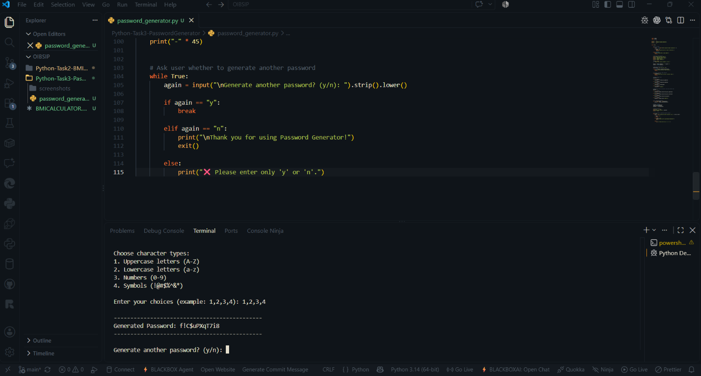
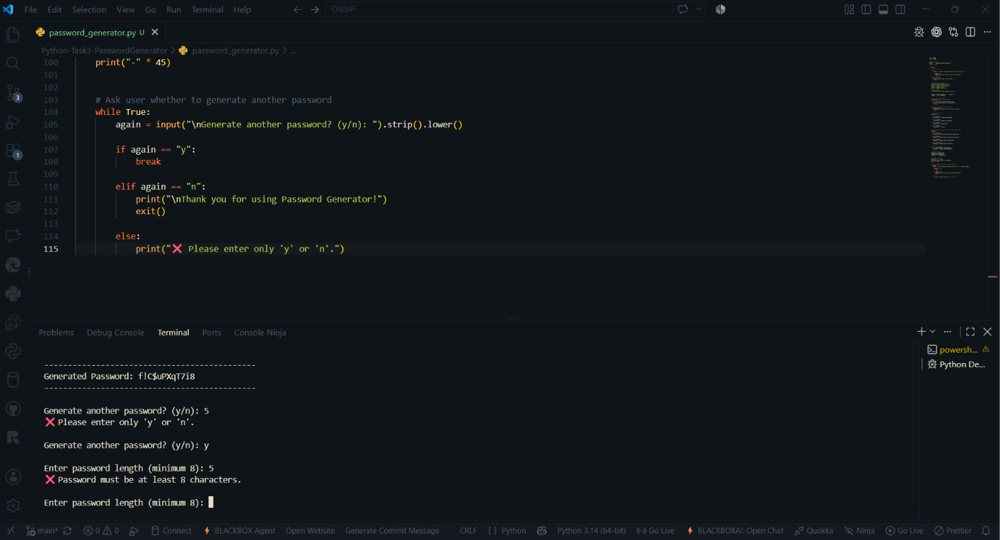
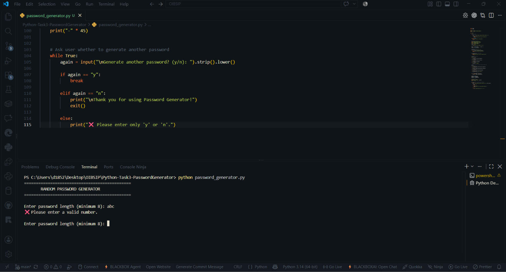
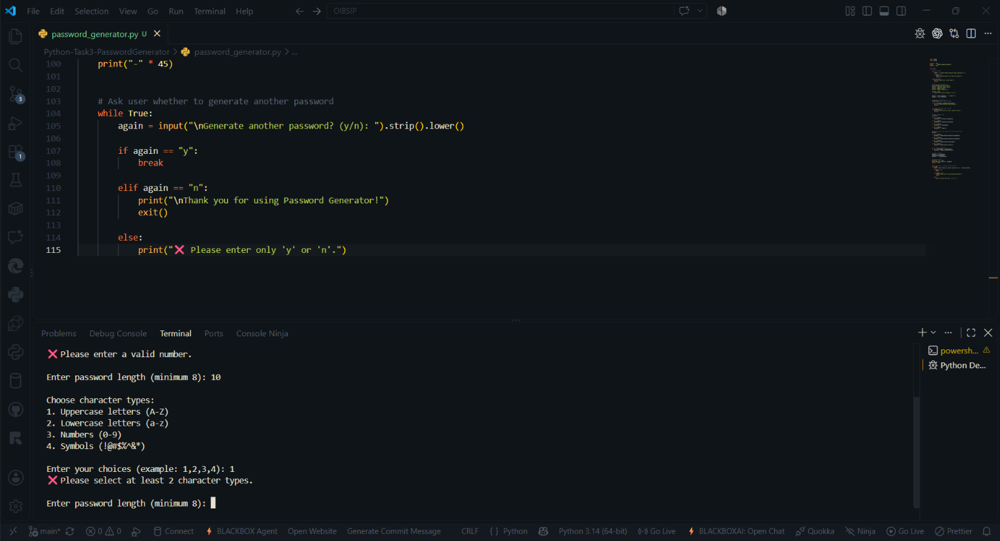

# Random Password Generator

## Overview

A simple Python-based Random Password Generator that creates customizable passwords based on user-selected character types.

This project was developed as Task 3 of the Oasis Infobyte Python Programming Internship.

## Features

- Minimum password length of 8 characters
- Uppercase letters (A-Z)
- Lowercase letters (a-z)
- Numbers (0-9)
- Common symbols (!@#$%^&*)
- At least 2 character types must be selected
- Ensures every selected character type is included
- Handles invalid input
- Generates another password without restarting

## Technologies Used

- Python
- Random module
- String module

## How to Run

1. Open the project folder.
2. Open a terminal in the project folder.
3. Run the following command:

python password_generator.py

4. Enter the desired password length.
5. Select the character types.
6. The generated password will be displayed.

## Character Types

| Option | Character Type |
|--------|----------------|
| 1 | Uppercase letters (A-Z) |
| 2 | Lowercase letters (a-z) |
| 3 | Numbers (0-9) |
| 4 | Symbols (!@#$%^&*) |

## Input Validation

The program checks:

- Password length must be at least 8 characters.
- At least 2 character types must be selected.
- Invalid password length input is rejected.
- Invalid character type selections are rejected.
- Only y or n is accepted for generating another password.

## Screenshots

### Normal Password

### Invalid Length

### Invalid Input

### Insufficient Character Types

## Internship

Oasis Infobyte

Python Programming Internship

Task 3 - Random Password Generator